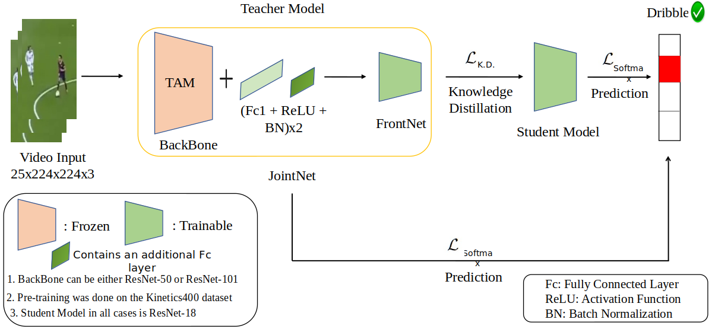

<div align='center'>
<h2 align="center"> SoccerKDNet: A Knowledge Distillation Framework for Action Recognition in Soccer Videos </h2>
<h3 align="center">10th International Conference on Pattern Recognition and Machine Intelligence (PReMI'23)</h3>

<a href="https://sarosijbose.github.io/">Sarosij Bose</a>, <a href="https://scholar.google.com/citations?user=hraBiJgAAAAJ">Saikat Sarkar</a> and <a href="https://sites.google.com/caluniv.ac.in/amlanc-org/">Amlan Chakrabarti</a>



</div>

## About:-

This work has been published in the 10th International Conference on Pattern Recognition and Machine Intelligence [PReMI'23](https://www.isical.ac.in/~premi23/) 2023!

The paper is available [here](https://doi.org/10.1007/978-3-031-45170-6_47)

## Abstract:-  

Classifying player actions from soccer videos is a challenging problem, which has become increasingly important in sports analytics over the years. Most state-of-the-art methods employ highly complex offline networks, which makes it difficult to deploy such models in resource constrained scenarios. Here, in this paper we propose a novel end-to-end knowledge distillation based transfer learning network pre-trained on the Kinetics400 dataset and then perform extensive analysis on the learned framework by introducing a unique loss parameterization. We also introduce a new dataset named “SoccerDB1” containing 448 videos and consisting of 4 diverse classes each of players playing soccer. Furthermore, we introduce an unique loss parameter that help us linearly weigh the extent to which the predictions of each network are utilized. Finally, we also perform a thorough performance study using various changed hyperparameters. We also benchmark the first classification results on the new SoccerDB1 dataset obtaining 67.20\% validation accuracy. The dataset has been made publicly available at: https://bit.ly/soccerdb1


## SoccerDB Dataset   

The dataset has been made publicly available here: https://bit.ly/soccerdb1

## Citation:-

Please consider citing this work if you found it useful:-

```latex
@inproceedings{10.1007/978-3-031-45170-6_47,
author = {Bose, Sarosij and Sarkar, Saikat and Chakrabarti, Amlan},
title = {SoccerKDNet: A Knowledge Distillation Framework for&nbsp;Action Recognition in&nbsp;Soccer Videos},
year = {2023},
isbn = {978-3-031-45169-0},
publisher = {Springer-Verlag},
address = {Berlin, Heidelberg},
url = {https://doi.org/10.1007/978-3-031-45170-6_47},
doi = {10.1007/978-3-031-45170-6_47},
abstract = {Classifying player actions from soccer videos is a challenging problem, which has become increasingly important in sports analytics over the years. Most state-of-the-art methods employ highly complex offline networks, which makes it difficult to deploy such models in resource constrained scenarios. Here, in this paper we propose a novel end-to-end knowledge distillation based transfer learning network pre-trained on the Kinetics400 dataset and then perform extensive analysis on the learned framework by introducing a unique loss parameterization. We also introduce a new dataset named “SoccerDB1” containing 448 videos and consisting of 4 diverse classes each of players playing soccer. Furthermore, we introduce an unique loss parameter that help us linearly weigh the extent to which the predictions of each network are utilized. Finally, we also perform a thorough performance study using various changed hyperparameters. We also benchmark the first classification results on the new SoccerDB1 dataset obtaining 67.20\% validation accuracy. The dataset has been made publicly available at: .},
booktitle = {Pattern Recognition and Machine Intelligence: 10th International Conference, PReMI 2023, Kolkata, India, December 12–15, 2023, Proceedings},
pages = {457–464},
numpages = {8},
keywords = {Action Recognition, Knowledge Distillation, Soccer Analytics},
location = {<conf-loc content-type="InPerson">Kolkata, India</conf-loc>}
}
```

## Acknowledgements:-

Parts of the codebase have been adapted from the [MIT-IBM HAR](https://github.com/IBM/action-recognition-pytorch) repository. 
We are grateful to the authors for making their work available.
